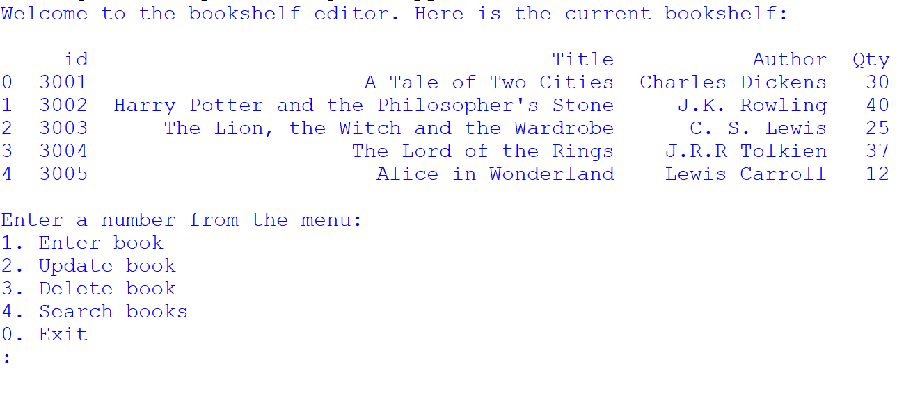
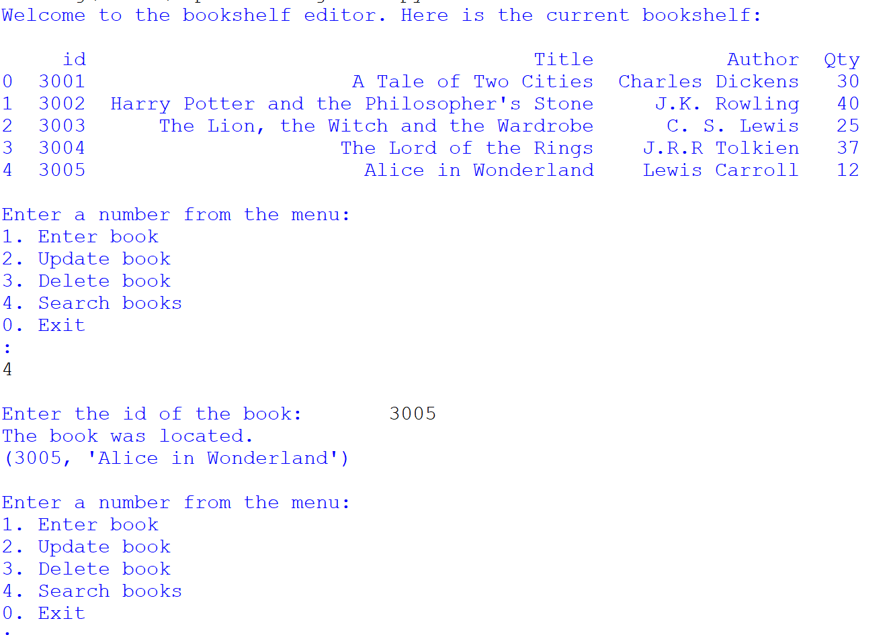

# Project name
Bookshelf

# Project description
*Importance of the project*

This project is a significant milestone in the learning process and aims to apply acquired knowledge to a real-world situation. The primary goal is to demonstrate competence in using Python and SQL, with an emphasis on practical application.

*Project description*
+ The project's objective is to create a program for a bookstore. This program is designed to assist bookstore clerks in managing book-related data. The program should enable clerks to perform several tasks:
	+ Add new books to the database
	+ Update book information
	+ Delete books from the database
	+ Search for the availability of books in the database.

*Database setup*
+ Create a database called "ebookstore" and a table called "books".
+ The table structure should include columns for "id," "Title," "Author," and "Qty."
+ Sample data for books is provided but can be extended with additional entries.
+ Populate the table with values.

*Menu interface*
+ The program should present the user with the following menu:
	1. Enter book
	1. Update book
	1. Delete book
	1. Search books
	1. Exit

# Installation section
*Tell other users how to install your project locally*

1. Install Python: 
    1. Download Python IDLE 3.7 to run the program
    1. Visit the official Python website at https://www.python.org/downloads/windows/ in your web browser.
    1. Click on the "Download Python 3.7" button
    1. Under Files section, download the one that matches your system architecture (32-bit or 64-bit). Most modern systems are 64-bit.
    1. Click on the installer to download it.
    1. Locate the downloaded installer file and double-click on it to run the Python installer.
    1. Check the box that says "Add Python 3.7 to PATH." 
    1. Click the "Install Now" button to start the installation process.
     
1. Open the Command Prompt (cmd)
    1. Clone repository: `git clone <repository-url>`
    1. Navigate to the project directory: `cd "path\to\Capstone Project I"`

1. Create a Virtual Environment:
    1. Create a folder for new virtual env: `mkdir Virtual_env`
    1. Navigate to folder: `cd Virtual_env`
    1. Create a virtual environment: `virtualenv bookshelfvenv`

1. Activate the Virtual Environment:
    + In Windows Command Prompt (Admin):
    1. In your Virtual_env folder there will be a folder called Scripts. Copy its path.
    1. Change directory to Scripts `cd "path\to\scripts\in\virtual\environment"`
    1. Activate virtual environment: `activate.bat`
    1. You will see (bookshelfvenv) at the start of cmd line
    1. change directory to app root directory: `cd "path\to\app"`

1. Verify Python installation: `python --version`
1. Verify pip installation: `pip --version`
1. Install the dependencies: `pip install -r requirements.txt`

# Usage section
*Instruct others on how to use your project after they’ve installed it.*

*Outline the steps necessary to build and run your application with venv and Docker:*
+ Activate virtual environment [see above]

+ Install Docker desktop @ https://www.docker.com/products/docker-desktop
+ Open Docker Desktop

## Use the Command Prompt
1. Check that Docker desktop was successfully installed: `docker run hello-world`
1. Build the docker image: `docker build -t bookshelf .` 
1. Run the docker image: `docker run -it bookshelf`
1. Deactivate the Virtual Environment: `deactivate`

## Use Docker Playground
1. Create a repository
1. Follow: https://labs.play-with-docker.com/
1. Start a new instance

In the terminal: 
1. Copy command from Dockerhub @ https://hub.docker.com/repository/docker/kcse1/bookshelf-capstone/general: `docker pull kcse1/bookshelf-capstone:latest`
1. Run the docker image: `docker run kcse1/bookshelf-capstone:latest`
1. Select an option from the bookshelf menu
1. Close session on Docker Playground

## Use Python IDLE
Run the program (F5) and select an option from the menu

1. Deactivate virtual environment when you are done working: `deactivate`

*Include screenshots of your project in action*

# Credits
*highlights and links to the authors of your project if the project has been created by more than one person*

@KC-software-en

# Add a URL to your GitHub repository

https://kc-software-en.github.io/friendly-robot/

