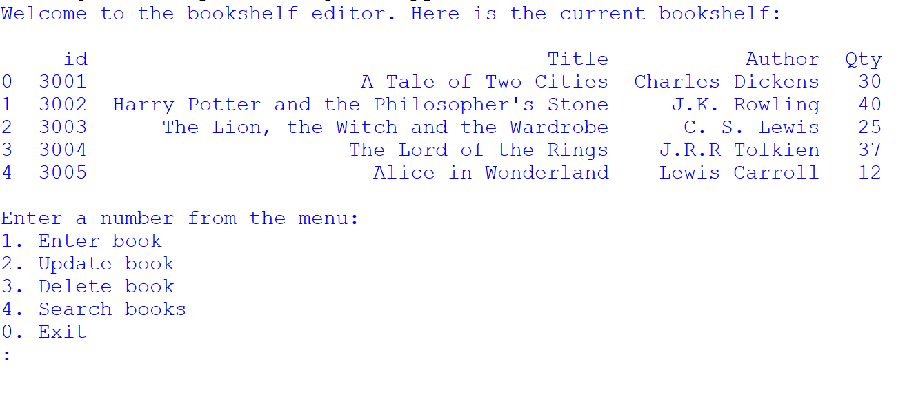
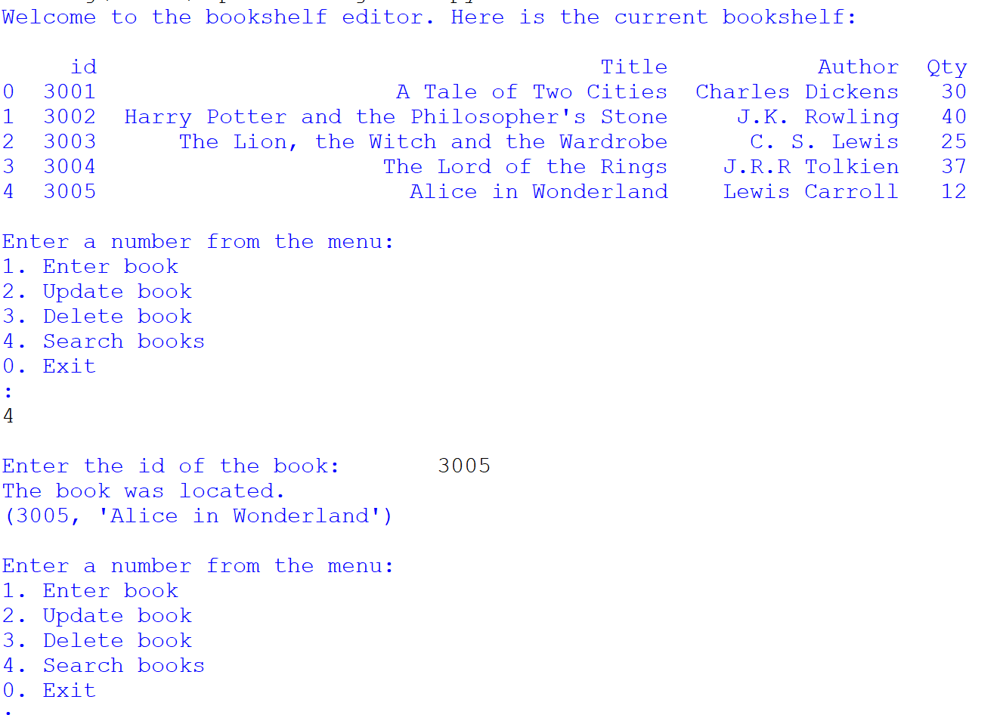

# Project name
Bookshelf

# Project description
*Importance of the project*

This project is a significant milestone in the learning process and aims to apply acquired knowledge to a real-world situation. The primary goal is to demonstrate competence in using Python and SQL, with an emphasis on practical application.

*Project description*
+ The project's objective is to create a program for a bookstore. This program is designed to assist bookstore clerks in managing book-related data. The program should enable clerks to perform several tasks:
	+ Add new books to the database
	+ Update book information
	+ Delete books from the database
	+ Search for the availability of books in the database.

*Database setup*
+ Create a database called "ebookstore" and a table called "books".
+ The table structure should include columns for "id," "Title," "Author," and "Qty."
+ Sample data for books is provided but can be extended with additional entries.
+ Populate the table with values.

*Menu interface*
+ The program should present the user with the following menu:
	1. Enter book
	1. Update book
	1. Delete book
	1. Search books
	1. Exit

# Installation section
*Tell other users how to install your project locally*

+ Download Python IDLE 3.7 to run the program
  1. Visit the official Python website at https://www.python.org/downloads/windows/ in your web browser.
  1. Click on the "Download Python 3.7" button
  1. Under Files section, download the one that matches your system architecture (32-bit or 64-bit). Most modern systems are 64-bit.
  1. Click on the installer to download it.
  1. Locate the downloaded installer file and double-click on it to run the Python installer.
  1. Check the box that says "Add Python 3.7 to PATH." This option is essential as it ensures that Python and pip are added to your system's PATH environment variable, making them accessible from the command line.
  1. Click the "Install Now" button to start the installation process.
     
+ Install pip
  1. After Python installation completes, open the Command Prompt. You can do this by searching for "cmd" in the Windows Start menu.
     
+ Check Python and pip Installation
  To verify that Python and pip have been installed successfully, run the following commands in the command prompt:
  1. python --version
  1. pip --version

+ Run program in a virtual environment

	in cmd:
1. Clone repository: `git clone <repository-url>`
1. Navigate to the project directory: `cd Capstone Project I`
1. Create a folder for new virtual env: `mkdir Virtual_env`
1. Navigate to folder: `cd Virtual_env`
1. Create a virtual environment: `virtualenv bookshelfvenv`
1. In your Virtual_env folder there will be a folder called Scripts. Copy its path.
1. Navigate to path for Scripts: `cd "paste path here"`
1. Activate virtual environment: `activate.bat`
1. You will see (bookshelfvenv) at the start of cmd line
2. Install the dependencies: `pip install -r requirements.txt`
1. Deactivate virtual environment when you are done working: `deactivate`

# Usage section
*instructs others on how to use your project after they’ve installed it.*

Open Python IDLE
Run the program (F5) and select an option from the menu

*Include screenshots of your project in action*

# Credits
*highlights and links to the authors of your project if the project has been created by more than one person*

@KC-software-en

# Add a URL to your GitHub repository

https://kc-software-en.github.io/friendly-robot/

